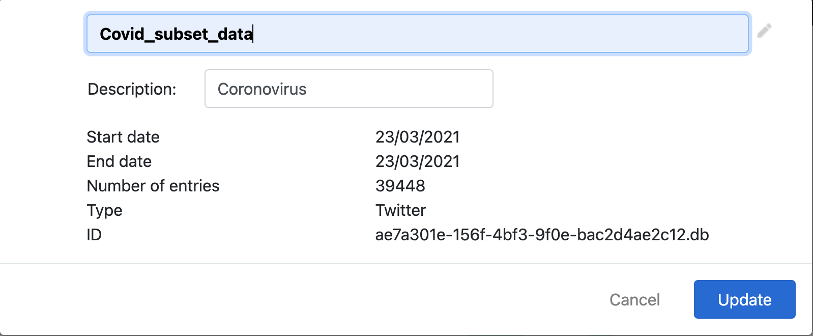

## Before We Start
- Setup COSMOS.
- Authorising your Twitter account to collect data.

# Lesson
***
After setting up COSMOS on your machine, you can start the software as it is instructed. 

Once COSMOS is launched in your browser, click the plus button on the top left corner. There are options `Import Data`, `Import RSS Feed`, `Start Twitter Collection`, and `Import Classifier`. We will start a Twitter collection:

1. Click `Start Twitter Collection`.
2. Give a appropriate name for the collection on the `Twitter Collection` pop-up window.
{:height="500px" width="400px"}
3. You can filter the collection based on `keywords and hashtags`, `language`, `location` and `Twitter accounts`. Also, you can specifiy the maximum numer of tweets for the collection.
4. When the form is filled, click the submit button. The collection (football) starts and can be seen on the panel.
{:height="250px" width="500px"}

> ## More on Collections
>
> The collection takes time as it streams tweets in real-time.    
> **While the collection continues**, clicking the three dots on the show panel:
> * Stop the collection when enough data has been collected
> * **Snapshot** the collection to create a subset data which has been collected until the snapshot
> {:height="250px" width="400px"}
> * Delete the collection
>
> **When collection has been stopped**, clicking the three dots on the show panel: 
> * **Query:** You can filter your collected data based on `tweets sentiment`, `date`, `gender`, `language` and `country`.
{:height="400px" width="400px"}
> When you query the dataset, it creates another subset data based on the query details.
> * **Export Data Details**
> * **Export collected data set**
> * **Delete**
> * **Apply classifier** (if you have one)
> * **Details of data set such as started date, name of the collection,...**
>
>
>
{: .callout}

  
***  
#### You can also watch youtube video clicking the image below for all data collection process with COSMOS.
***

<iframe width="560" height="315" src="https://www.youtube.com/embed/FfkSW46scLM" frameborder="0" allow="accelerometer; autoplay; clipboard-write; encrypted-media; gyroscope; picture-in-picture" allowfullscreen></iframe>

> ## Exercise
> Collect `10000` english tweets using ``, `` keywords, for ``, `` Twitter accounts using COSMOS 2.0
>
{: .challenge}

> ## Exercise
> While collection continues; 
> 1. Create a subset and give it a appropriate name. 
> Which COSMOS feature did you use for this purpose? 
> 2. Create and name a subset filtering only sentimentally
> `negative` tweets in the `last two days`.
> Which COSMOS feature did you use for this purpose? 
>
> > ## Solution
> > 1. Click 3 dots on the panel and select `Snapshot`. After creating a subset click 3 dots and choose `Details` option from dropdown menu, edit the name of the subset and hit the `Update` button.
> > {:height="200px" width="400px"}
> > 2.  Click 3 dots on the panel and select `Query`. Then, fill the form on the pop-up window choosing sentiment score as a negative number(between -5 to 0) and entering date of last two days and click the `Query` button. After creating a subset, click 3 dots again and choose `Details` option from dropdown menu, edit the name of the subset and hit the `Update` button.
> {: .solution}
{: .challenge}

