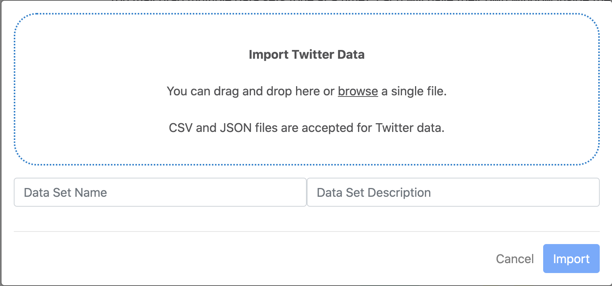
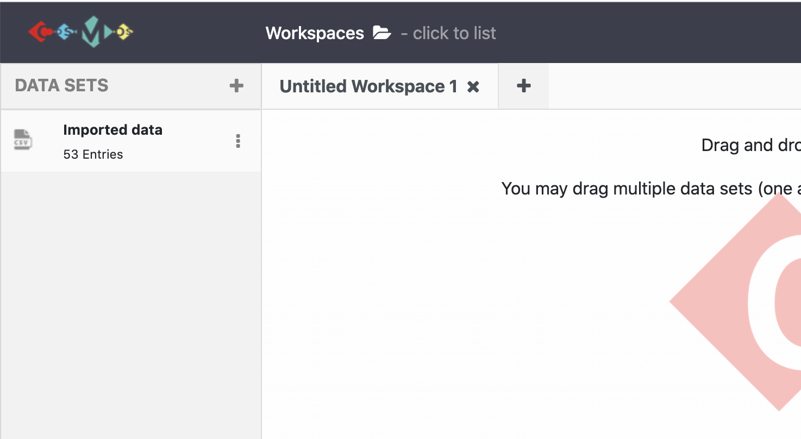

# Lesson
***
After setting up COSMOS on your machine, you can start the software as it is instructed. 

Once COSMOS is launched in your browser, click the plus button on the top left corner. There are options `Import Data`, `Import RSS Feed`, `Start Twitter Collection`, and `Import Classifier`. We will import pre-existing data on COSMOS:
1. Click `Import Data`.
2. Then, you can `drag and drop` or `browse` your single file.
3. Name the dataset and write some explanation by filling the form on the popup window.
{:height="250px" width="500px"}
4. After filling the form and selecting the file, just hit the `import` button.
5. The imported data set appears on the `Show Panel` and it is ready to use.
{:height="250px" width="400px"}

> ## Tip: 
>
> Only CSV and JSON files are accepted for Twitter data.
>
{: .callout}

> ## Exercise
> 1. Import and name any pre-existing data on COSMOS following the same steps.
>
{: .challenge}
