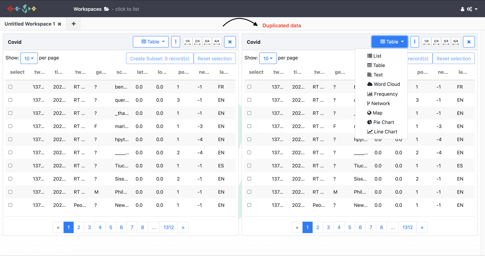
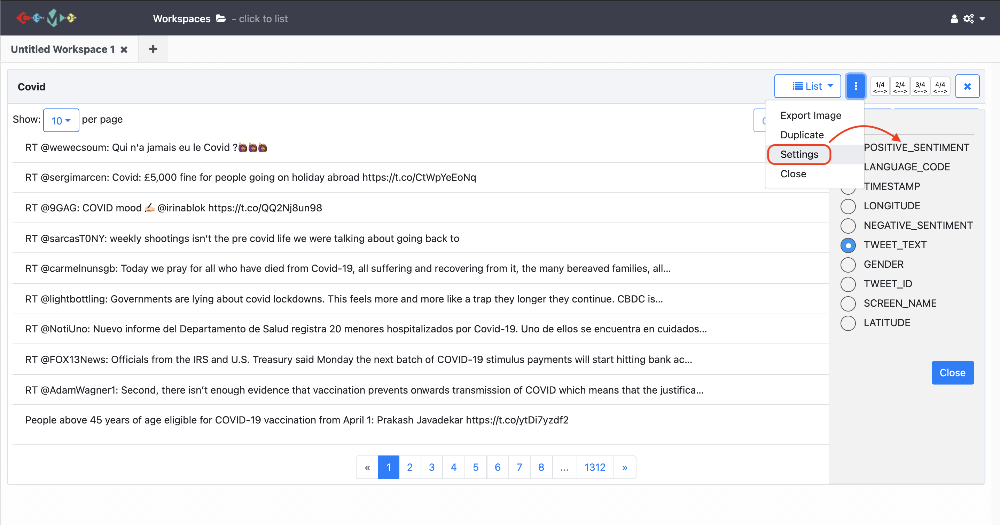
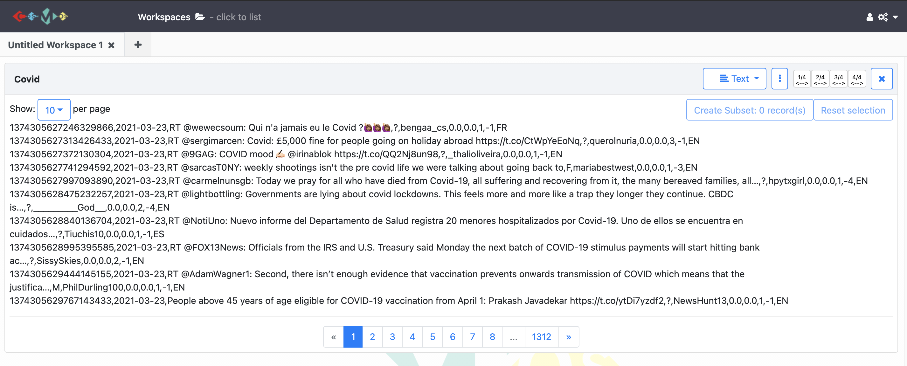
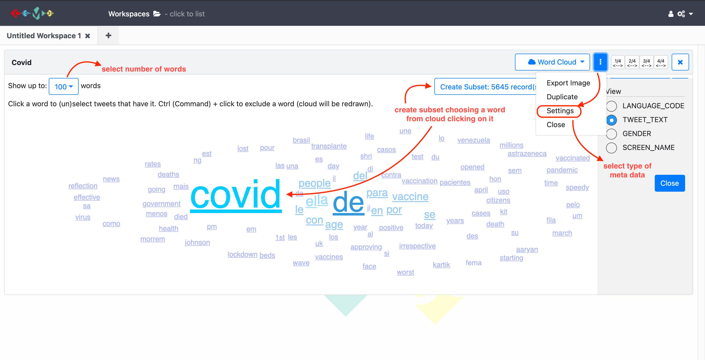
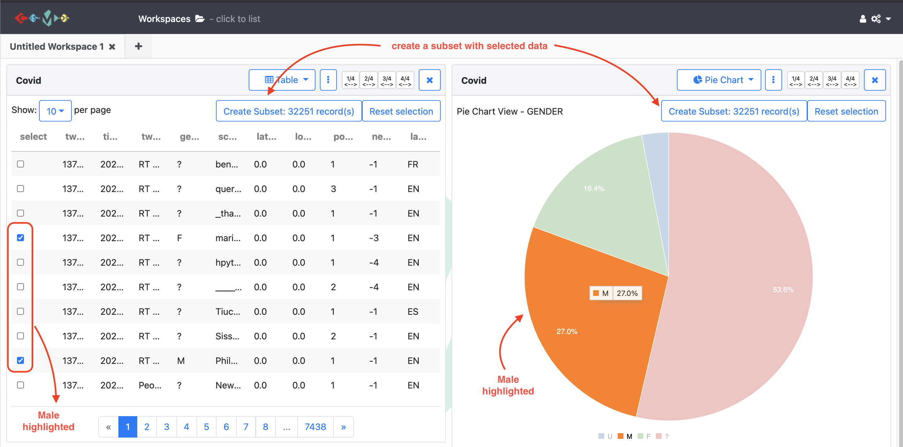

# Lesson
***
## 1. Visualize the Data Collection
Once enough data has been collected or imported using COSMOS, it is time to visualize data to obtain details and information we are looking for. To start visualization:

1. `Drag and drop` the data collection to the `workspace`
2. Once you drag and drop the data collection to the workspace, `table view` opens automatically.
{:height="400px" width="750px"}

## 2. Multiple Visualization Views

There are 10 visualization options in COSMOS. When you click the little arrow on the `Table` button (top of the right-hand side of the page), it shows the all options (`List`, `Table`, `Text`, `Word Cloud`, `Frequency`, `Network`, `Map`, `Shape File`, `Pie Chart`, `Line Chart`)

If you want to visualize same data collection using more than one option:
- Click the 3 dots button on the right-hand side of the page and choose `Duplicate`.
- When it is duplicated, you can choose one of visualization options. To do that, click the `Table` button and choose one from the drop down menu.
{:height="450px" width="750px"}

#### a) List
For the list view, you can create a list selecting type of meta data. To do that, click the 3 dots in the top of the right-hand corner and choose the `Settings`. Then, choose one of the option you need from the drop-down menu. See the illustration below:

{:height="400px" width="750px"} 
#### b) Text
Text view just demonstrates text version of the metadata.
{:height="300px" width="750px"} 
#### c) Word Cloud 
For the work cloud view you can;
- select the number of the words show up on the cloud clicking the little arrow in the top of the left-hand corner.
- (un)select tweets that including a word by clicking on this word and create a subset dataset.
- exclude tweets that including a word by `Ctrl(command) + click` on this word and create a subset dataset.
- select type of meta data you want to illustrate by clicking on `3 dots` and then `Settings`.
{:height="350px" width="850px"} 

#### d) Frequency
There is a separate lesson for frequency view.
#### e) Network
#### f) Map 
#### g) Shape File
#### h) Pie Chart
For the pie chart view you can;
- select type of meta data you want to illustrate by clicking on `3 dots` and then `Settings`.
- click one of the slices on the pie chart and create a subset for this group.
- see the percentage of each group represents.
{:height="350px" width="800px"}

#### i) Line Chart
For the line chart view you can;
- specify the y-axis of the line chart base on the meta data.
- create multi-line charts to represent and compare more than one series in the dataset. 

**Add screenshot after fix**

> ## More on Visualizations
>
> Once you create more than one visualization, selecting data in one view highlights the same data in the other views. 
> 
> **For example;**
> 
> let's say we created one table view and on pie chart view. When we click on one of the pie chart slices (female one), it highlights 
> female tweets on the Table view.
>{:height="400px" width="800px"}
>
{: .callout}

> ## Exercises
>
> 1. Create a pie chart representing `negative sentiments`. Then, create and name a subset data set for the group of tweets which has sentiment score is '-3'.
> 2. Visualize your data collection using `Word Cloud` view showing up to 50 words. Then, create and name a subset including one of the most used word in `Twitter text`.  
> 3. Create a multi-line chart representing `positive sentiment` and `negative sentiment`.
{: .challenge}

